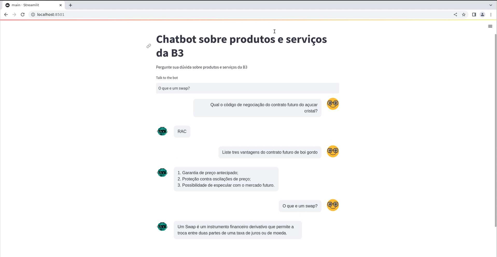

# B3 products and services QA chatbot
==============================



This is a project to create a QA chatbot to answer questions about B3 products and services.


# 1 Pre-requisites

**Ubuntu/Debian/Mint**

The GNU/Linux Make utility is required to run the Makefile. To install it, run the following command:

```bash
sudo apt-get install build-essential
```

Also, the Python 3 interpreter is required to run the project. To install it, run the following command:

```bash
sudo apt-get install python3
```

# 1.1 Environment Setup

To set up the environment, run the following command:

```bash
python3 -m venv ~/path/to/venv
```

To activate the environment, run the following command:

```bash
source ~/path/to/venv/bin/activate
```

# 1.2 Install Dependencies

To install the dependencies, run the following command:

```bash
make requirements
```

# 2 Configure OpenAI API

For this project, we will use the OpenAI API to generate responses for the chatbot. To configure the API, you need to create an account in [OpenAI](https://openai.com/). After that, you need to create an API key in the [dashboard](https://dashboard.openai.com/). Finally, you need to add the API key to conf/parameters.yaml in the api_key field.


# 3 Run the Project

In this project, we use Makefile to run the project steps. To run the project, run the following commands:

```bash
make download_urls
```
This command will download the urls from the urls of products and services from B3 website.

```bash
make download_docs
```
This command will download the text documents from the urls downloaded in the previous step.

```bash
make cleaning_docs
```
This command will clean the text documents downloaded in the previous step.

```bash
make write_docs
```
This command will write the text documents in a Elasticsearch database

```bash
make qa_model
```
This command will generate the QA pipeline and save in a yaml file


# 4 Project Organization
------------

    ├── LICENSE                         <- Repository license
    ├── Makefile                        <- Makefile with commands like `make write_docs` or `make qa_model`
    ├── README.md                       <- The top-level README for developers using this project.
    ├── app                             <- App folder with the API and the web app
    │   ├── backend                     <- Backend folder with the API and the data expecting for the api
    │   │   └── api.py                  <- API with the endpoints to predict and train the model
    │   └── frontend                    <- Frontend folder with the web app
    │       └── main.py                 <- Web app with the interface to predict and train the model
    ├── conf                            <- Configuration folder with the parameters used by the project
    │   ├── catalog.yaml                <- Catalog file with the paths to the data
    │   ├── parameters.yaml             <- Parameters file with the parameters used by the project
    │   └── pipeline.yaml               <- Pipeline file with the pipeline used by the project
    ├── configs.ini                     <- Config file with the parameters to be used by the API
    ├── data                            <- Data folder with the data used by the project
    │   ├── 01_raw                      <- Raw data folder
    │   ├── 02_intermediate             <- Intermediate data folder
    │   └── 03_features                 <- Features data folder
    ├── notebooks                       <- Jupyter notebooks used to experiment and develop the project
    ├── requirements-dev.in             <- The file where you should put the development dependencies like Black, Pytest, etc.
    ├── requirements-dev.txt            <- ❗This file will be automatically generated by the pip-compile, DON'T EDIT IT❗
    ├── requirements.in                 <- The file where you should put the modules and scripts dependencies.
    ├── requirements.txt                <- ❗This file will be automatically generated by the pip-compile, DON'T EDIT IT❗
    ├── src                             <- Source code for use in this project.
    │   └── pipelines                   <- Pipeline folder with the pipeline used by the project
    │       ├── etl                     <- ETL pipeline folder with the scripts used by the pipeline
    │       │   ├── cleaning_docs.py    <- Script to clean the text documents
    │       │   ├── download_docs.py    <- Script to download the text documents
    │       │   ├── download_urls.py    <- Script to download the urls from the B3 website
    │       │   ├── prepare_data.py     <- Script to prepare the data to be used by the API
    │       │   ├── scrap_data.py       <- Script to scrap the data from the B3 website
    │       │   └── write_docs.py       <- Script to write the text documents in a Elasticsearch database
    │       └── qa                      <- QA pipeline folder with the scripts used by the pipeline
    │           └── qa_model.py         <- Script to generate the QA pipeline and save in a yaml file
    └── tox.ini                         <- tox file with settings for running tox; see tox.testrun.org
------------


# 5 Test model with the API

To test the model with the API, run the following command:

```bash
uvicorn app.backend.api:app --reload
```

After that you can open in another terminal the UI to test the API with the following command:

```bash
streamlit run app/frontend/main.py 
```

# TODO

- [ ] Add logs
- [ ] Add tests
- [ ] Add CI/CD
- [ ] Add Dockerfile
- [ ] Add Docker Compose
- [ ] Add orchestration with Prefect
- [ ] Refactor the code
